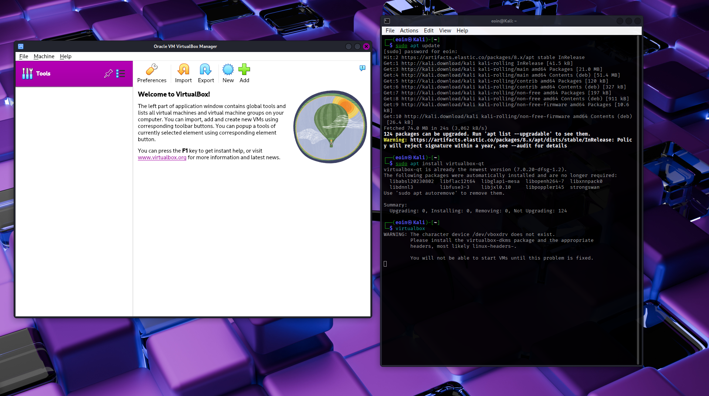

# VirtualBox Setup

## Objective

Install and configure VirtualBox on Kali Linux to enable creation of isolated virtual machines for the SOC lab environment.

---

## Installation Steps

### 1. Install VirtualBox with Qt interface

```bash
sudo apt update
sudo apt install virtualbox-qt

