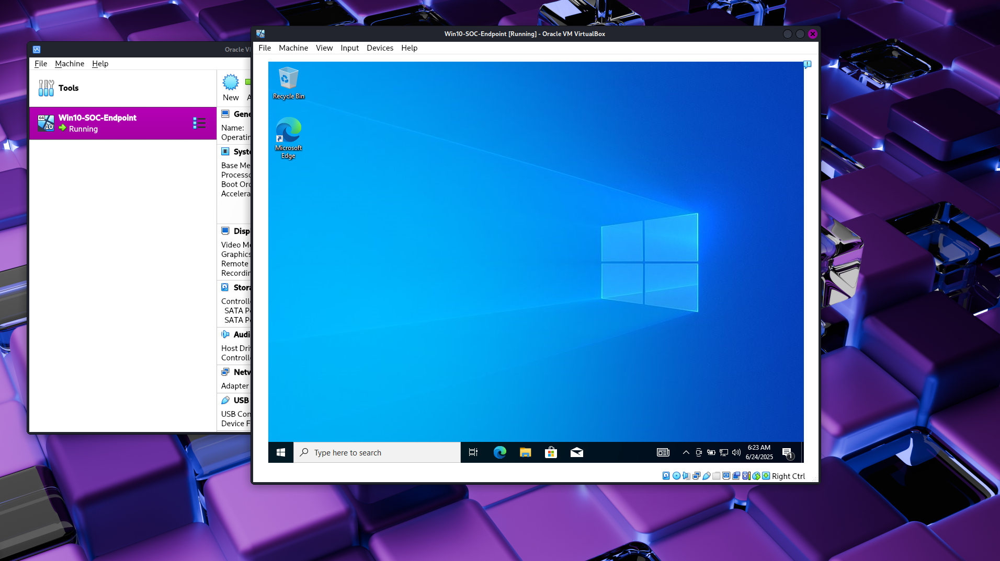

# Windows 10 VM Installation

## Objective

Install and configure a Windows 10 virtual machine to serve as an endpoint for SOC lab analysis. This VM will generate logs, receive a Wazuh agent, and be the target of simulated attacks.

---

## Virtual Machine Configuration

| Setting         | Value                           |
|-----------------|---------------------------------|
| Name            | Win10-SOC-Endpoint              |
| OS Version      | Windows 10 Pro (64-bit)         |
| RAM             | 4096 MB                         |
| CPU             | 4 Cores                         |
| Disk Size       | 80 GB (Dynamically Allocated)   |
| Network Adapter | Internal Network (SOC-Lab-Net)  |
| ISO Used        | Windows 10 22H2 ISO             |

---

## Installation Steps

1. Downloaded the official Windows 10 ISO from Microsoft's [Windows 10 ISO page](https://www.microsoft.com/en-us/software-download/windows10ISO).
2. Created a new VM in VirtualBox with the configuration listed above.
3. Mounted the ISO and booted the VM.
4. Installed Windows 10 using the following local account:
   - Username: `analyst`
   - Password: *(custom secure password)
5. Skipped Microsoft account setup and declined optional features (Cortana, telemetry).
6. Installed all Windows updates.
7. Took a VirtualBox screenhot labeled `baseline`.

---

## Post-Install Notes

- Windows Defender was left enabled for realism, but SmartScreen and cloud-based protection were disabled for lab tool compatibility.
- A static IP will be configured in the networking setup phase (see `03-networking-config.md`).
- This VM will receive Sysmon and the Wazuh agent in later steps.

---

## Screenshot

