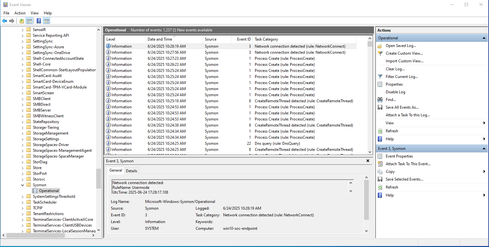

# Sysmon Installation

## Objective

Install Microsoft Sysinternals Sysmon on the Windows 10 endpoint to enable granular event logging. This forms a critical component of the endpoint visibility stack in the SOC lab.

---

## Sysmon Purpose

Sysmon provides detailed event logging for process creation, network connections, file writes, and more. It works in tandem with tools like Wazuh and Windows Event Forwarding (WEF) to supply deep endpoint telemetry for detection engineering.

---

## Files Used

The following files were downloaded from Microsoft and placed in a shared folder named `SysmonShare`:

- `Sysmon.exe`
- `Sysmon64.exe`
- `Eula.txt`
- `sysmonconfig.xml` – SwiftOnSecurity’s public config file  
  [Source](https://github.com/SwiftOnSecurity/sysmon-config)

---

## Host Setup

### 1. Create Shared Folder (from Kali host)

Directory created:

```
/home/eoin/VM-Shares/Sysmon  
```

Contents copied into that directory (unzipped from Microsoft Sysinternals zip).


### 2. Configure VM Shared Folder

In VirtualBox Manager:
- Go to **Settings → Shared Folders**
  - Folder Path: `/home/eoin/VM-Shares/Sysmon`
  - Folder Name: `SysmonShare`
  - Options enabled:  
    Auto-mount  
    Make Permanent

> Guest Additions were installed prior to this step to enable shared folder access.

---

## In-VM Installation

### 1. Map the Shared Folder in Windows 10 VM

``` 
net use Z: \VBOXSVR\SysmonShare  
```

### 2. Run Sysmon with Configuration

``` 
Z:\Sysmon64.exe -accepteula -i Z:\sysmonconfig.xml  
```

Output should confirm successful installation.

---

## Verification

### 1. Check Sysmon Service

``` 
sc query sysmon64  
```


### 2. Check Event Viewer for Logging

In Event Viewer, navigate to:
- `Applications and Services Logs → Microsoft → Windows → Sysmon → Operational`

You should see event IDs such as:
- `1` — Process Create
- `3` — Network Connection Detected
- `8` — CreateRemoteThread
- `22` — DNS Query



---

## Snapshot Taken

Snapshot Name: **Post-Sysmon-Install**

This snapshot serves as a rollback point prior to any agent deployments or attack simulations.

---

## Troubleshooting & Lessons Learned

### Shared Folder Not Appearing

**Issue:**  
`\VBoxSvr\SysmonShare` was not visible in File Explorer.

**Resolution:**
- Discovered **Guest Additions** had not been installed.
- Downloaded and manually mounted the `VBoxGuestAdditions.iso` into the VM via VirtualBox Storage settings.
- Ran `VBoxWindowsAdditions.exe` inside Windows.
- Rebooted the VM and confirmed shared folder auto-mounted.

---

### `tasklist | findstr sysmon` Returned No Output

**Issue:**  
Expected process not shown in task list.

**Resolution:**
- Realized Sysmon runs as a **service**, not a traditional background process.
- Verified service state with:

``` 
sc query sysmon64  
```

- Verified logs are being generated in Event Viewer under Sysmon → Operational.

---

## Reflection

This install process highlighted:
- The importance of **VirtualBox Guest Additions** for shared folder integration.
- How **Windows CMD limitations** can complicate otherwise simple commands.
- The value of using Event Viewer to verify logging.
- That real-world setups often deviate from "ideal" guides — and how documenting each step and error improves clarity and reproducibility.