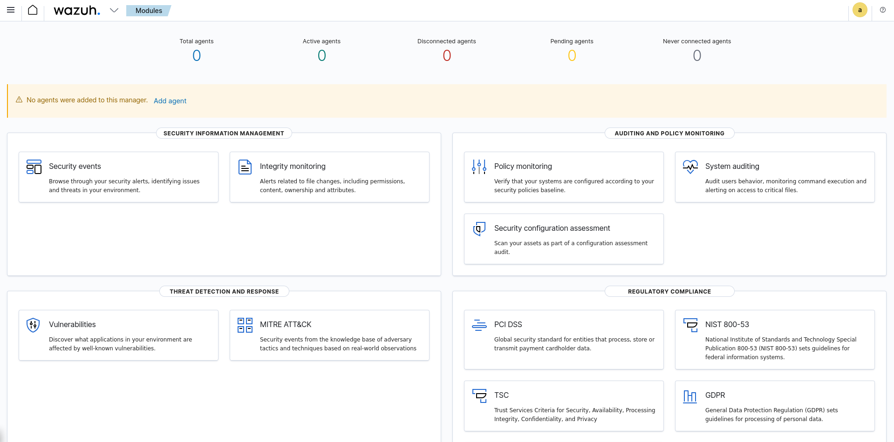
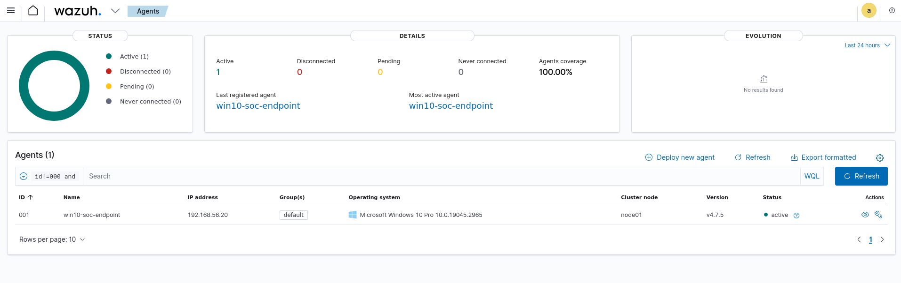

# 05 - Wazuh Setup and Agent Deployment

## Objective

Deploy the Wazuh Security Information and Event Management (SIEM) platform locally via Docker and configure a Windows 10 VM as an agent to forward logs and events.

---

## Host Machine Setup (Kali)

### Step 1: Download and Run Installer Script

Downloaded and executed the Wazuh installer:

```
curl -sO https://packages.wazuh.com/4.7/wazuh-install.sh
chmod +x wazuh-install.sh
sudo ./wazuh-install.sh -a -i
```

> Note: Kali is not officially supported. The `-i` flag was used to ignore OS checks.

### Step 2: Access Wazuh Dashboard

After the install, accessed Wazuh at:

- URL: `https://localhost`
- User: `admin`
- Password: (provided during install)



---

## VM Setup (Windows 10)

### Step 1: Download Agent

Manually downloaded the Wazuh agent `.msi` on the host machine from:

https://packages.wazuh.com/4.x/windows/wazuh-agent-4.7.5-1.msi

Copied the file into the shared folder `SysmonShare`.

### Step 2: Install Agent on VM

Accessed the shared folder from the VM:

- `\VBoxSvr\SysmonShare`

Ran the `.msi` to install the Wazuh agent. After install:

- Agent location: `C:\Program Files (x86)\ossec-agent\`

### Step 3: Configure Agent

1. Opened `ossec.conf` in Notepad++ from:
   - `C:\Program Files (x86)\ossec-agent\ossec.conf`

2. Replaced the `<server-ip>` with the **host machine’s IP**

### Step 4: Register and Start Agent

In CMD as Administrator:

```
cd "C:\Program Files (x86)\ossec-agent\"
manage-agent.exe
```

- Chose **(I)nsert** to register the agent
- Set name to `Win10-SOC-Endpoint` and provided host’s IP
- Saved and exited

Started the service:

```
net start wazuhsvc
```

---

## Verification

Back on the Wazuh Dashboard:

- Verified the agent was listed and active.
- Event Viewer confirmed Sysmon was logging and Wazuh was forwarding logs.



---

## Troubleshooting

| Issue | Solution |
|-------|----------|
| `System error 5 has occurred` when starting service | Ran CMD as Administrator |
| Agent service wouldn’t start | Missing or incorrect `<server-ip>` in config |
| No logs appearing in `C:\Program Files (x86)\ossec-agent\logs` | Config error — resolved by correcting IP |
| Shared folder not visible | Installed VirtualBox Guest Additions to enable shared folders |
| Could not execute installer | Used shared folder method to transfer `.msi` to VM |

---

## Reflection

Despite initial friction with running Wazuh on Kali (unsupported OS), it installed and ran well with the ignore-check flag. The shared folder method proved reliable for transferring files, and Sysmon integration with Wazuh confirms a solid baseline for log forwarding and detection. We're now ready to simulate attacks and validate SOC alerting.

--