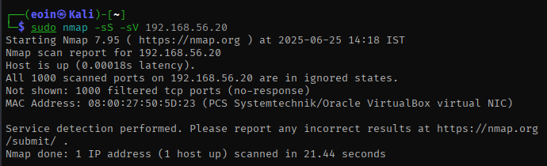
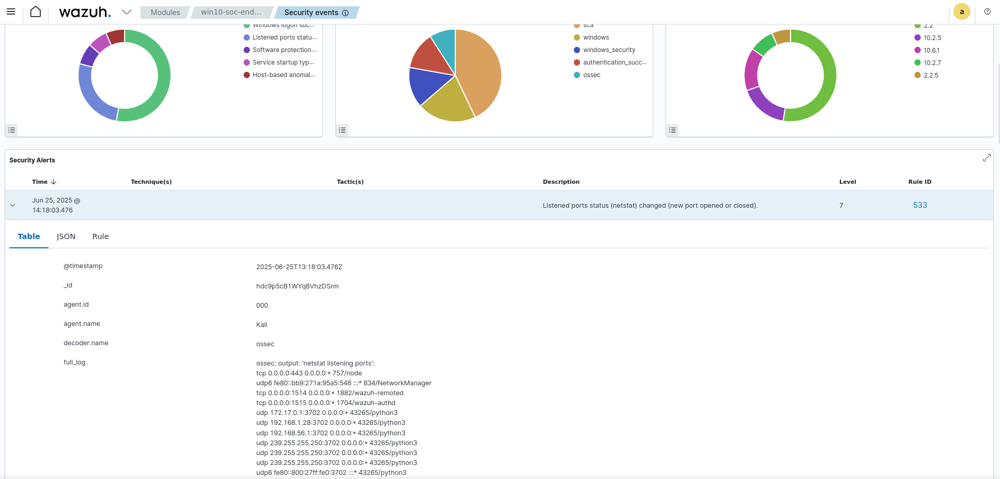

# Detection Report: External Port Scan (Nmap)

## Summary

This report documents the simulated external port scanning of a Windows 10 VM endpoint using `nmap` from the Kali host machine. The goal was to test visibility of reconnaissance behavior in both Sysmon and Wazuh.

---

## Environment

| Component        | Value                    |
|------------------|--------------------------|
| Target OS        | Windows 10 (VM)          |
| Attacker Machine | Kali Linux (Host)        |
| Network Type     | Host-only (vboxnet0)     |
| Target IP        | 192.168.56.20            |
| Attacker IP      | 192.168.56.1             |

---

## Attack Details

### Command Executed from Kali:

```
sudo nmap -sS -sV 192.168.56.20
```



### Objective:

Simulate a real-world reconnaissance attempt by scanning open TCP ports and detecting services.

---

## Detection Results

### Sysmon (on Windows VM):

| Observation | Result |
|-------------|--------|
| Event ID 1 (Process Create) | Not triggered |
| Event ID 3 (Network Connection) | Not triggered |
| Notes | Sysmon does not log *inbound* network connections by default. This is expected behavior. |

---

### Wazuh Dashboard:

| Observation | Result |
|-------------|--------|
| Alert Triggered | Yes |
| SourceIdentified | Kali |
| Event Metadata | Logged through Windows logs forwarded by the Wazuh agent |
| Notes | The port scan was successfully detected by Wazuh even though Sysmon did not log it. |


---

## Lessons Learned

- **Sysmon is limited to outbound connections** unless extended via additional configurations or paired with a network monitor.
- **Wazuh is more comprehensive** when integrating with Windows Event Logs.


---