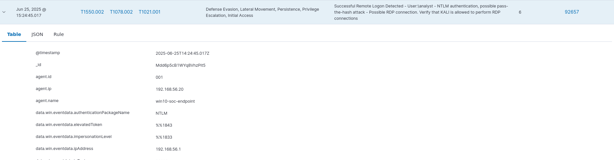

# Detection Report: SMB Share Enumeration

## Summary

This detection scenario simulated an internal reconnaissance phase where an attacker uses the `smbclient` tool to enumerate available SMB shares on a target host (Windows 10 VM). The enumeration was launched from the Kali Linux host against the VM endpoint `192.168.56.20`.

---

## Attack Phase

### Reconnaissance — SMB Share Enumeration

- **Tool Used:** `smbclient`
- **Attacker Machine:** Kali Linux (Host)
- **Target Machine:** Windows 10 (VM)
- **Command Executed:**

 ```
  smbclient -L //192.168.56.20/ -U analyst
 ```

- **Credentials Used:**
  - Username: `analyst`
  - Password: (configured on VM)

---

## Observations

### Sysmon

- No `Event ID 3 (NetworkConnect)` entries related to SMB enumeration were logged.
- Existing entries for unrelated services (e.g., OneDrive) confirmed that Sysmon was operational.
- Likely reasons for missing logs:
  - SMB traffic initiated by `System`/`svchost.exe` is not always captured by Sysmon.
  - The configuration file may not explicitly capture kernel-level network activity.

### Wazuh

- Wazuh successfully detected and logged the enumeration activity.
- Evidence included network session attempts and successful authentication to SMB shares.
- Logs potentially included Windows Firewall or Security Log Event IDs (e.g., 5156 - Filtering Platform).

---

## Shares Enumerated

```
Sharename       Type      Comment
---------       ----      -------
ADMIN$          Disk      Remote Admin
C$              Disk      Default Share
IPC$            IPC       Remote IPC
```

---

## Troubleshooting Steps

1. **Initial Connection Timeout:**
   - SMB tools returned `NT_STATUS_IO_TIMEOUT`.
   - VM networking was reverified (Host-only Adapter `vboxnet0` + static IP).

2. **SMB Not Reachable:**
   - Confirmed the VM’s Windows Defender Firewall was blocking incoming SMB requests.
   - Resolved by enabling File and Printer Sharing using:
     ```
     Enable-NetFirewallRule -DisplayGroup "File and Printer Sharing"
     ```

3. **Missing SMB Feature Support:**
   - `smbclient` failed with `NT_STATUS_RESOURCE_NAME_NOT_FOUND` and `no workgroup available`.
   - Resolved by enabling the following Windows features via **Control Panel → Programs → Turn Windows features on or off**:
     - Enable - SMB 1.0/CIFS Client  
     - Enable - SMB 1.0/CIFS Server  
   - A reboot was required for the change to take effect.

4. **Sysmon Not Logging SMB Activity:**
   - Reinstalled and reconfigured Sysmon using the custom config file.
   - Logging resumed, but SMB events did not appear in Sysmon.
   - Relied on Wazuh for confirmation of SMB activity detection.

## Detection Value

| Source  | Signal                        | Detection? |
|---------|-------------------------------|------------|
| Sysmon  | Event ID 3 — TCP Connect      |  No        |
| Wazuh   | Network + Auth Activity       |  Yes       |

---

## Reflection

This scenario highlighted a key point in blue team visibility:

- Not all tools log the same data — Wazuh provided critical coverage where Sysmon was silent.
- Layered detection with both host-level agents and event log shipping is essential.
- It’s important to verify that your configurations (e.g., Sysmon config XML) explicitly support the attack techniques you're testing.

---